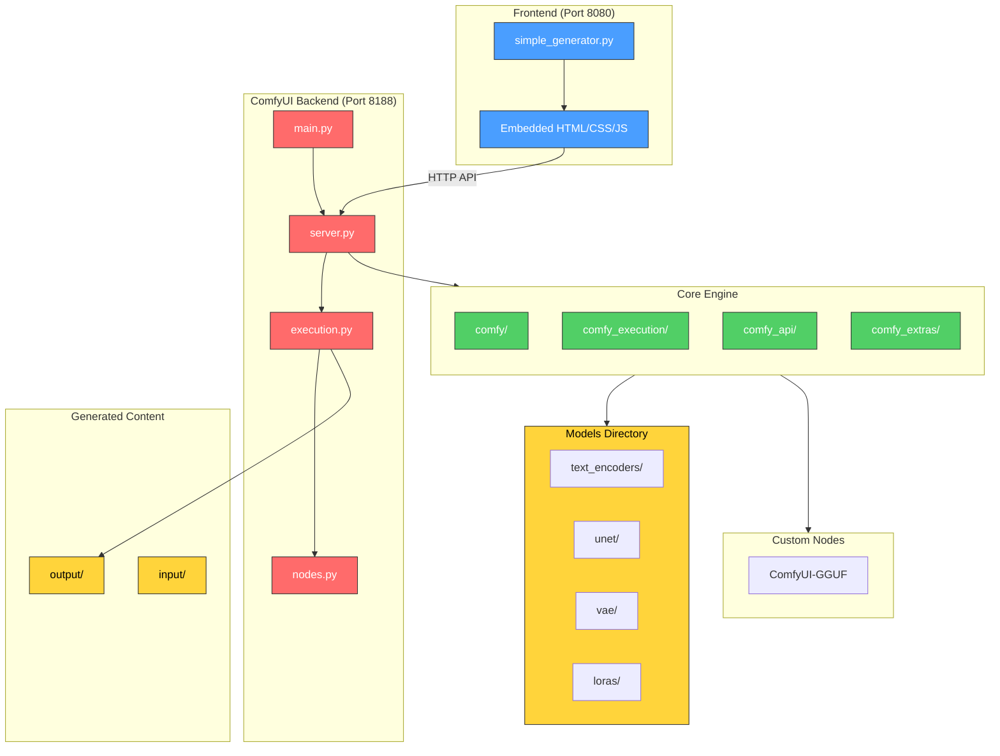
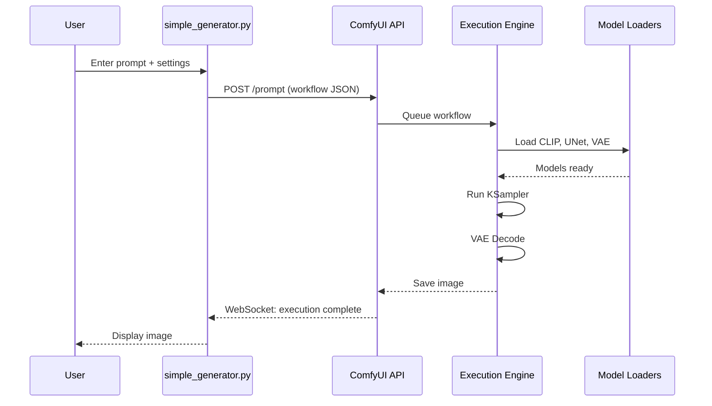

# Architecture Overview



## Component Overview

| Component | Purpose |
|-----------|---------|
| `simple_generator.py` | Standalone GUI (6500 lines) - HTTP server + embedded UI |
| `server.py` | ComfyUI WebSocket/HTTP server |
| `execution.py` | Workflow execution engine |
| `nodes.py` | Core node definitions |
| `comfy/` | Inference engine, model loading, samplers |
| `comfy_extras/` | Additional node packs |
| `custom_nodes/` | GGUF quantization support |

## Data Flow



## File Structure

```
qwen-image-generator/
├── simple_generator.py    # Main GUI application
├── main.py                # ComfyUI entry point
├── server.py              # HTTP/WebSocket server
├── execution.py           # Workflow executor
├── nodes.py               # Node definitions
├── comfy/                 # Core inference
├── comfy_api/             # API layer
├── comfy_execution/       # Execution management
├── comfy_extras/          # Extra nodes
├── custom_nodes/          # GGUF support
├── models/                # AI models
├── output/                # Generated images
└── input/                 # Reference images
```
